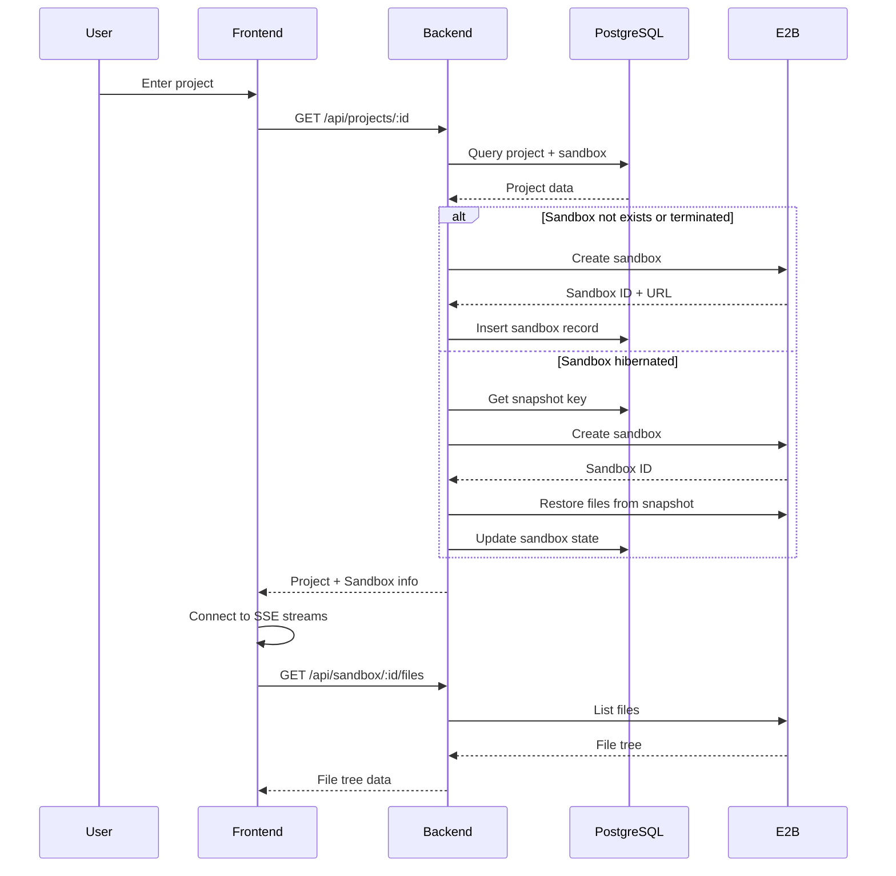
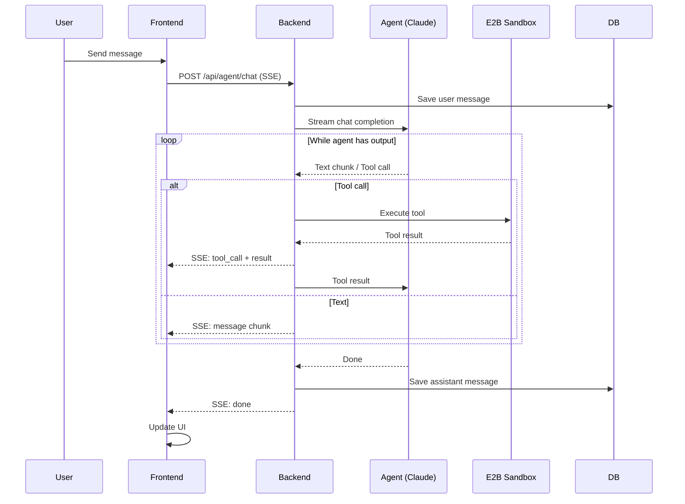

# Design Document: AI Sandbox Builder v1

## Overview

本文档描述 AI Sandbox Builder v1 的技术架构设计。该系统允许用户通过自然语言与 AI Agent 对话，在 E2B 云沙箱中自动构建全栈 Web 应用。

### 系统边界

```
┌─────────────────────────────────────────────────────────────────┐
│                         Frontend (React)                        │
│  ┌──────────┐ ┌──────────┐ ┌──────────┐ ┌──────────┐          │
│  │ Chat UI  │ │ File Tree│ │ Preview  │ │ Terminal │          │
│  └──────────┘ └──────────┘ └──────────┘ └──────────┘          │
└─────────────────────────────────────────────────────────────────┘
                              │ HTTP/SSE
                              ▼
┌─────────────────────────────────────────────────────────────────┐
│                      Backend (Hono + Node.js)                   │
│  ┌──────────────┐ ┌──────────────┐ ┌──────────────────────────┐│
│  │ Project API  │ │ Sandbox Mgr  │ │ Agent Orchestrator       ││
│  └──────────────┘ └──────────────┘ │ (claude-agent-sdk)       ││
│                                    └──────────────────────────┘│
└─────────────────────────────────────────────────────────────────┘
         │                    │                    │
         ▼                    ▼                    ▼
    ┌──────────┐      ┌──────────────┐      ┌──────────────┐
    │ PostgreSQL│      │ E2B Sandbox  │      │ Claude API   │
    │ (Drizzle)│      │ (per project)│      │ (Anthropic)  │
    └──────────┘      └──────────────┘      └──────────────┘
```

### Agent SDK 选型：`@anthropic-ai/claude-agent-sdk`

根据 [官方 Hosting 文档](https://platform.claude.com/docs/en/agent-sdk/hosting)，`claude-agent-sdk` 专门支持在云沙箱环境（包括 E2B）中部署运行。

**为什么使用 `claude-agent-sdk`：**
1. 内置完整的工具系统（Read、Edit、Bash、Glob、Grep 等）
2. 自动处理 agent 循环、上下文管理、错误恢复
3. 官方支持的 E2B 部署方案
4. 支持 MCP 扩展自定义工具

**部署模式：Hybrid Sessions**

根据官方文档的推荐模式，我们采用 "Hybrid Sessions" 模式：
- Ephemeral containers 按需创建，处理用户请求
- 支持 session resumption 保持对话上下文
- 空闲时可以暂停（利用 E2B 的 `betaPause()`）
- 用户返回时恢复继续

**沙箱系统要求：**
- Node.js 18+
- Claude Code CLI: `npm install -g @anthropic-ai/claude-code`
- 推荐资源：1GiB RAM, 5GiB disk, 1 CPU
- 网络：需要访问 `api.anthropic.com`

参考链接：
- [Claude Agent SDK Hosting](https://platform.claude.com/docs/en/agent-sdk/hosting)
- [Claude Agent SDK Sessions](https://platform.claude.com/docs/en/agent-sdk/sessions)
- [E2B Sandbox Persistence](https://e2b.dev/docs/sandbox/persistence)

---

## Architecture

### 核心组件

#### 1. Sandbox Manager

负责 E2B 沙箱的完整生命周期管理。

```typescript
// Sandbox states
type SandboxState = 'creating' | 'running' | 'paused' | 'terminated';

// Sandbox info stored in database
interface SandboxRecord {
  id: string;           // E2B sandbox ID
  projectId: string;
  state: SandboxState;
  previewUrl?: string;
  agentSessionId?: string;  // Claude Agent SDK session ID
  lastActiveAt: Date;
  createdAt: Date;
}

// E2B Sandbox lifecycle operations
class SandboxManager {
  async create(projectId: string): Promise<Sandbox> {
    const sandbox = await Sandbox.create({
      template: 'base',  // 预装 Node.js + Claude Code CLI
    });
    // Install claude-agent-sdk in sandbox
    await sandbox.commands.run('npm install -g @anthropic-ai/claude-code');
    return sandbox;
  }

  async pause(sandboxId: string): Promise<void> {
    const sandbox = await Sandbox.connect(sandboxId);
    await sandbox.betaPause();  // E2B native pause - saves filesystem + memory
  }

  async resume(sandboxId: string): Promise<Sandbox> {
    // E2B automatically resumes paused sandbox on connect
    return await Sandbox.connect(sandboxId);
  }

  async terminate(sandboxId: string): Promise<void> {
    const sandbox = await Sandbox.connect(sandboxId);
    await sandbox.kill();
  }
}
```

关键设计决策：

- **休眠策略**: 用户离开 30 秒后调用 `betaPause()` 暂停沙箱
- **状态恢复**: 使用 E2B 原生的 `Sandbox.connect()` 恢复，自动还原文件系统和内存状态
- **最长生命周期**: 沙箱最长存活 30 天（E2B 限制），超时后需重新创建
- **单实例原则**: 每个项目同一时刻最多只有一个活跃沙箱

#### 2. Agent Orchestrator

使用 `@anthropic-ai/claude-agent-sdk` 在 E2B 沙箱内运行 Claude Agent。

**E2B 沙箱内的 Agent 运行架构：**

```
┌─────────────────────────────────────────────────────────────┐
│                      E2B Sandbox                            │
│  ┌─────────────────────────────────────────────────────┐   │
│  │  Node.js Runtime                                     │   │
│  │  ┌─────────────────┐  ┌─────────────────────────┐   │   │
│  │  │ Claude Code CLI │  │ claude-agent-sdk        │   │   │
│  │  │ (installed)     │  │ (SDK process)           │   │   │
│  │  └─────────────────┘  └─────────────────────────┘   │   │
│  │            ↓                      ↓                  │   │
│  │  ┌─────────────────────────────────────────────┐    │   │
│  │  │  Built-in Tools: Read, Write, Edit, Bash,   │    │   │
│  │  │  Glob, Grep, WebFetch, WebSearch            │    │   │
│  │  └─────────────────────────────────────────────┘    │   │
│  │            ↓                                         │   │
│  │  ┌─────────────────────────────────────────────┐    │   │
│  │  │  Sandbox Filesystem (project files)          │    │   │
│  │  └─────────────────────────────────────────────┘    │   │
│  └─────────────────────────────────────────────────────┘   │
└─────────────────────────────────────────────────────────────┘
                              ↑ HTTP/SSE
                              │
┌─────────────────────────────────────────────────────────────┐
│                    Backend (Hono)                           │
│   - 管理沙箱生命周期                                          │
│   - 转发用户消息到沙箱内的 Agent                               │
│   - 流式返回 Agent 响应给前端                                  │
└─────────────────────────────────────────────────────────────┘
```

**Agent 调用示例：**

```typescript
// 在 E2B 沙箱内运行的 agent worker 脚本
import { query } from "@anthropic-ai/claude-agent-sdk";

// 接收来自后端的用户消息
const userMessage = process.argv[2];
const sessionId = process.env.SESSION_ID;

const response = query({
  prompt: userMessage,
  options: {
    // 恢复之前的会话（如果存在）
    resume: sessionId || undefined,
    // 允许的工具集
    allowedTools: ["Read", "Write", "Edit", "Bash", "Glob", "Grep"],
    // 自动批准文件编辑
    permissionMode: "acceptEdits",
    // 系统提示
    systemPrompt: `You are an AI assistant helping to build web applications.
You have access to a sandboxed environment where you can read/write files and execute commands.
The project is located in /home/user/project.`,
  }
});

// 流式输出所有消息
for await (const message of response) {
  // 输出到 stdout，后端通过 sandbox.commands 读取
  console.log(JSON.stringify(message));
}
```

**关键配置项：**

```typescript
interface AgentConfig {
  // 工具权限
  allowedTools: ['Read', 'Write', 'Edit', 'Bash', 'Glob', 'Grep', 'WebFetch'];

  // 权限模式 - 自动批准文件操作
  permissionMode: 'acceptEdits';

  // 会话管理 - 支持恢复之前的对话
  resume?: string;  // session_id
  forkSession?: boolean;

  // 资源限制
  maxTurns?: number;  // 最大对话轮次
  maxBudgetUsd?: number;  // 最大花费
}
```

**Session 管理：**

- 每个项目维护一个 `session_id`，存储在数据库
- 用户发送新消息时，使用 `resume: sessionId` 恢复上下文
- Session 数据由 Claude Agent SDK 在沙箱内自动管理
- 沙箱休眠/恢复后，session 上下文保持完整

#### 3. Real-time Communication

使用 Server-Sent Events (SSE) 实现服务端到客户端的实时推送。

```typescript
// SSE event types
type SSEEventType =
  | 'agent:thinking'      // Agent is processing
  | 'agent:tool_call'     // Agent is calling a tool
  | 'agent:tool_result'   // Tool execution result
  | 'agent:message'       // Agent text response (streaming)
  | 'agent:done'          // Agent finished
  | 'agent:error'         // Agent error
  | 'sandbox:status'      // Sandbox state change
  | 'file:changed'        // File system change
  | 'terminal:output';    // Terminal output stream
```

选择 SSE 而非 WebSocket 的原因：
- 更简单的实现和调试
- 自动重连机制
- 与 Hono 更好的集成
- 单向推送已满足需求

---

## Components and Interfaces

### API Routes

遵循现有项目的 Hono 路由模式：

```typescript
// apps/api/src/routes/projects.ts
const projectsRoute = new Hono()
  .get('/', ...)           // List user's projects
  .post('/', ...)          // Create project
  .get('/:id', ...)        // Get project details
  .delete('/:id', ...)     // Delete project
  .post('/:id/sandbox', ...)  // Ensure sandbox is running

// apps/api/src/routes/agent.ts
const agentRoute = new Hono()
  .post('/chat', ...)      // Send message to agent (returns SSE stream)
  .post('/stop', ...)      // Stop current agent execution

// apps/api/src/routes/sandbox.ts
const sandboxRoute = new Hono()
  .get('/:projectId/files', ...)      // List files
  .get('/:projectId/files/*', ...)    // Read file content
  .get('/:projectId/terminal', ...)   // Terminal output stream (SSE)
  .get('/:projectId/preview', ...)    // Get preview URL

// apps/api/src/routes/conversations.ts
const conversationsRoute = new Hono()
  .get('/:projectId', ...)    // Get conversation history
```

### Shared Schemas

```typescript
// packages/shared/src/schemas/project.ts
export const createProjectSchema = z.object({
  name: z.string().min(1).max(100),
  description: z.string().max(500).optional(),
});

export const projectSchema = z.object({
  id: z.string().uuid(),
  name: z.string(),
  description: z.string().nullable(),
  userId: z.string(),
  sandboxState: z.enum(['creating', 'running', 'hibernating', 'hibernated', 'terminated']),
  previewUrl: z.string().nullable(),
  createdAt: z.string().datetime(),
  updatedAt: z.string().datetime(),
});

// packages/shared/src/schemas/conversation.ts
export const messageRoleSchema = z.enum(['user', 'assistant']);

export const messageSchema = z.object({
  id: z.string().uuid(),
  role: messageRoleSchema,
  content: z.string(),
  toolCalls: z.array(z.object({
    id: z.string(),
    name: z.string(),
    input: z.record(z.unknown()),
    result: z.unknown().optional(),
  })).optional(),
  createdAt: z.string().datetime(),
});

export const sendMessageSchema = z.object({
  projectId: z.string().uuid(),
  content: z.string().min(1).max(10000),
});
```

### Service Layer

```typescript
// apps/api/src/services/sandbox.service.ts
interface SandboxService {
  ensureRunning(projectId: string): Promise<SandboxInfo>;
  hibernate(projectId: string): Promise<void>;
  terminate(projectId: string): Promise<void>;
  executeCommand(projectId: string, command: string): AsyncIterable<string>;
  writeFile(projectId: string, path: string, content: string): Promise<void>;
  readFile(projectId: string, path: string): Promise<string>;
  listFiles(projectId: string, path?: string): Promise<FileNode[]>;
  getPreviewUrl(projectId: string): Promise<string | null>;
}

// apps/api/src/services/agent.service.ts
interface AgentService {
  chat(
    projectId: string,
    userId: string,
    message: string
  ): AsyncIterable<AgentEvent>;
  stop(projectId: string): Promise<void>;
}
```

---

## Data Models

### Database Schema

```typescript
// apps/api/src/db/schema.ts

// Projects table
export const projects = pgTable('projects', {
  id: uuid('id').primaryKey().defaultRandom(),
  name: text('name').notNull(),
  description: text('description'),
  userId: text('user_id')
    .notNull()
    .references(() => user.id, { onDelete: 'cascade' }),
  createdAt: timestamp('created_at', { mode: 'date', withTimezone: true })
    .notNull()
    .defaultNow(),
  updatedAt: timestamp('updated_at', { mode: 'date', withTimezone: true })
    .notNull()
    .defaultNow(),
});

// Sandboxes table - tracks E2B sandbox instances
export const sandboxes = pgTable('sandboxes', {
  id: text('id').primaryKey(),  // E2B sandbox ID
  projectId: uuid('project_id')
    .notNull()
    .references(() => projects.id, { onDelete: 'cascade' })
    .unique(),  // One sandbox per project
  state: text('state', {
    enum: ['creating', 'running', 'paused', 'terminated']
  }).notNull().default('creating'),
  previewUrl: text('preview_url'),
  // Claude Agent SDK session ID for conversation continuity
  agentSessionId: text('agent_session_id'),
  lastActiveAt: timestamp('last_active_at', { mode: 'date', withTimezone: true })
    .notNull()
    .defaultNow(),
  createdAt: timestamp('created_at', { mode: 'date', withTimezone: true })
    .notNull()
    .defaultNow(),
});

// Conversations table - stores chat history
export const conversations = pgTable('conversations', {
  id: uuid('id').primaryKey().defaultRandom(),
  projectId: uuid('project_id')
    .notNull()
    .references(() => projects.id, { onDelete: 'cascade' }),
  createdAt: timestamp('created_at', { mode: 'date', withTimezone: true })
    .notNull()
    .defaultNow(),
});

// Messages table - individual messages in conversation
export const messages = pgTable('messages', {
  id: uuid('id').primaryKey().defaultRandom(),
  conversationId: uuid('conversation_id')
    .notNull()
    .references(() => conversations.id, { onDelete: 'cascade' }),
  role: text('role', { enum: ['user', 'assistant'] }).notNull(),
  content: text('content').notNull(),
  toolCalls: jsonb('tool_calls'),  // Array of tool call objects
  createdAt: timestamp('created_at', { mode: 'date', withTimezone: true })
    .notNull()
    .defaultNow(),
});

// Note: File snapshots are handled by E2B's native betaPause() feature
// No additional storage tables needed
```

### Relations

```typescript
export const projectsRelations = relations(projects, ({ one, many }) => ({
  user: one(user, {
    fields: [projects.userId],
    references: [user.id],
  }),
  sandbox: one(sandboxes),
  conversations: many(conversations),
}));

export const sandboxesRelations = relations(sandboxes, ({ one }) => ({
  project: one(projects, {
    fields: [sandboxes.projectId],
    references: [projects.id],
  }),
}));

export const conversationsRelations = relations(conversations, ({ one, many }) => ({
  project: one(projects, {
    fields: [conversations.projectId],
    references: [projects.id],
  }),
  messages: many(messages),
}));

export const messagesRelations = relations(messages, ({ one }) => ({
  conversation: one(conversations, {
    fields: [messages.conversationId],
    references: [conversations.id],
  }),
}));
```

---

## Error Handling

### Error Codes

```typescript
// Sandbox-specific errors
export const sandboxErrors = {
  SANDBOX_CREATE_FAILED: 'Failed to create sandbox',
  SANDBOX_NOT_FOUND: 'Sandbox not found',
  SANDBOX_TIMEOUT: 'Sandbox operation timed out',
  SANDBOX_QUOTA_EXCEEDED: 'Sandbox quota exceeded',
  FILE_NOT_FOUND: 'File not found in sandbox',
  COMMAND_FAILED: 'Command execution failed',
};

// Agent-specific errors
export const agentErrors = {
  AGENT_BUSY: 'Agent is already processing a request',
  AGENT_TIMEOUT: 'Agent response timed out',
  TOOL_EXECUTION_FAILED: 'Tool execution failed',
  CONTEXT_TOO_LONG: 'Conversation context exceeds limit',
};
```

### Error Response Format

遵循现有项目的统一响应格式：

```typescript
// Error response
{
  success: false,
  error: {
    message: 'Sandbox creation failed',
    code: 'SANDBOX_CREATE_FAILED',
    issues: [{ detail: 'E2B quota exceeded' }]
  }
}
```

### Retry Strategy

- E2B API 调用：指数退避，最多 3 次重试
- Claude API 调用：最多 2 次重试
- 沙箱恢复失败：自动创建新沙箱

---

## Testing Strategy

### Unit Tests

- **Service Layer**: Mock E2B SDK 和 Claude SDK，测试业务逻辑
- **Route Handlers**: 使用 Hono 的测试工具验证请求/响应
- **Schemas**: 验证 Zod schema 的边界情况

### Integration Tests

- **Sandbox Lifecycle**: 测试创建 → 使用 → 休眠 → 恢复 → 终止的完整流程
- **Agent Conversation**: 测试多轮对话和工具调用
- **SSE Streaming**: 验证事件流的正确性

### E2E Tests (Manual for v1)

- 项目创建和进入
- Agent 对话生成代码
- 实时预览功能
- 文件树同步
- 页面离开和返回后的状态恢复

---

## Key Technical Decisions

### 1. 为什么选择 SSE 而非 WebSocket？

| 考量 | SSE | WebSocket |
|------|-----|-----------|
| 实现复杂度 | 低 | 高 |
| 双向通信 | 否（但够用） | 是 |
| 自动重连 | 内置 | 需实现 |
| 与 Hono 集成 | 原生支持 | 需额外库 |
| 调试体验 | 优秀 | 一般 |

结论：v1 使用 SSE，未来如需要双向通信再迁移到 WebSocket。

### 2. 沙箱状态持久化策略

选项对比：

- **A. 仅保存文件快照** - 简单，但丢失运行时状态
- **B. E2B 原生休眠** - 保留完整状态，但依赖 E2B 特性
- **C. 混合方案** - 文件快照 + 记录关键运行状态

**v1 采用 E2B 原生 Persistence（Beta）功能：**

根据 E2B 文档，沙箱支持原生的暂停/恢复：
- `await sbx.betaPause()` - 暂停沙箱，保存完整的文件系统 + 内存状态
- `await Sandbox.connect(sandboxId)` - 恢复已暂停的沙箱

关键限制：
- 沙箱最长存活 30 天（从创建开始计算）
- 暂停耗时约 4 秒/GiB RAM
- 恢复耗时约 1 秒
- 该功能目前在 Beta 阶段，对所有用户免费

**不需要额外的对象存储（R2/S3）**，E2B 会处理状态持久化

### 3. Agent 上下文管理

```
每次 Agent 调用的 System Prompt 结构：

1. 基础角色定义
2. 当前项目信息
3. 可用工具列表
4. 最近 N 条对话历史
5. 当前文件树摘要（仅目录结构）
```

Token 限制策略：
- 对话历史最多保留最近 20 轮
- 文件树仅展示前 3 层目录
- 超长文件内容截断 + 摘要

### 4. 环境变量

```bash
# E2B Configuration
E2B_API_KEY=xxx                    # E2B API key
E2B_TEMPLATE_ID=base               # Default sandbox template

# Claude API Configuration
ANTHROPIC_API_KEY=xxx              # Anthropic API key

# Sandbox Configuration
SANDBOX_IDLE_TIMEOUT_MS=30000      # 30 seconds before hibernation
SANDBOX_MAX_HIBERNATE_MS=3600000   # 1 hour before termination
```

**注意：不需要额外的对象存储配置**，E2B 原生的 `betaPause()` 功能会处理沙箱状态的持久化

---

## Sequence Diagrams

### 项目进入与沙箱启动



### Agent 对话流程



---

## Frontend Components

### 页面结构

```
┌─────────────────────────────────────────────────────────────────┐
│ Header: Project Name                            [Settings] [Exit]│
├────────────────┬────────────────────────────────────────────────┤
│                │                                                │
│   File Tree    │              Main Editor / Preview             │
│   (Sidebar)    │                                                │
│                │                                                │
│   - src/       ├────────────────────────────────────────────────┤
│     - App.tsx  │                                                │
│     - main.tsx │              Chat Panel                        │
│   - package.   │              (Collapsed by default)            │
│                │                                                │
├────────────────┴────────────────────────────────────────────────┤
│ Terminal Output (Collapsible)                                   │
└─────────────────────────────────────────────────────────────────┘
```

### 状态管理

使用 TanStack Query 管理服务端状态：

```typescript
// Query keys
const queryKeys = {
  project: (id: string) => ['project', id],
  files: (projectId: string) => ['files', projectId],
  conversation: (projectId: string) => ['conversation', projectId],
};

// SSE connection state managed by custom hook
function useSandboxEvents(projectId: string) {
  // Subscribe to sandbox status, file changes, terminal output
}

function useAgentChat(projectId: string) {
  // Mutation that returns SSE stream for agent responses
}
```

---

## Security Considerations

### 沙箱隔离

- 每个用户的沙箱完全隔离（E2B 保证）
- API 层验证用户只能访问自己的项目
- 沙箱内的代码无法访问主系统

### 输入验证

- 所有用户输入通过 Zod schema 验证
- 文件路径参数经过清理，防止路径遍历
- Agent 的工具调用参数在执行前验证

### 速率限制 (v1 基础版)

- 每用户每分钟最多 30 次 Agent 调用
- 每用户最多同时运行 1 个沙箱
